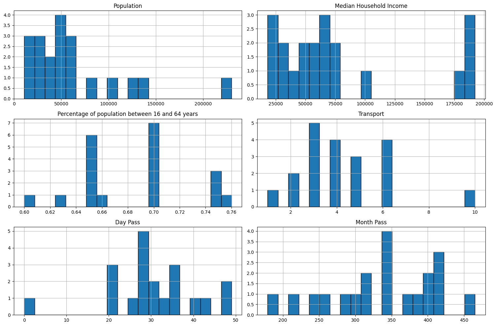
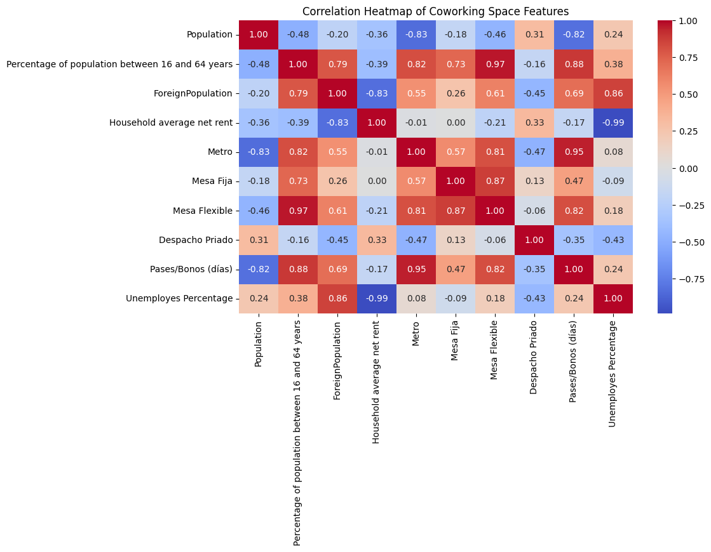
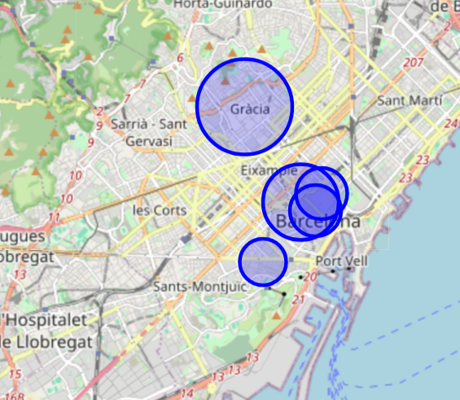
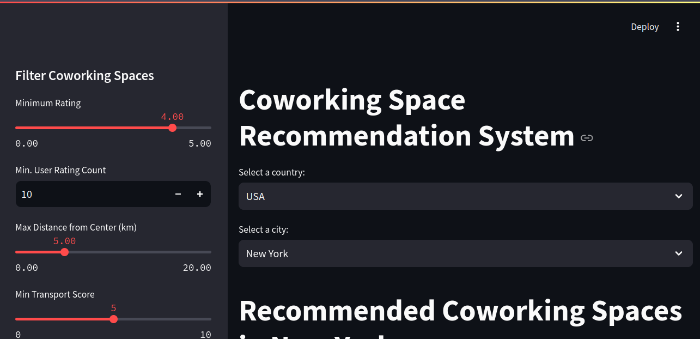

# 🏢 Coworking Space Analysis & Recommendation System

## Project Overview

This project focuses on creating a recommendation system for coworking spaces based on various features such as location, rating, transport facilities, and distance from the center. It includes a comprehensive analysis and prediction system to help users find the best coworking spaces in their preferred city.

## Features

- Coworking space recommendations based on user preferences (rating, distance, transport, etc.).
- Visualization of recommended coworking spaces on an interactive map.
- Predicted prices for coworking space daily passes.
- Interactive Streamlit web app for seamless user experience.

## Data Sources

The data for this project was gathered from multiple sources, including:

- Coworking space information (location, rating, number of reviews) via Google Places API
- Public transportation data from city transit authorities
- Pricing information collected manually from coworking space websites
- Geographic coordinates and distances calculated using GeoPy

## Technologies Used

- **Python 3.9** - Core programming language
- **Pandas 1.4.2** & **NumPy 1.22.3** - Data manipulation and analysis
- **Scikit-learn 1.0.2** - Machine learning algorithms
- **Streamlit 1.8.1** - Web application framework
- **Folium 0.12.1** - Interactive map visualization
- **Matplotlib 3.5.1** & **Seaborn 0.11.2** - Data visualization
- **Joblib 1.1.0** - Model serialization
- **GeoPy 2.2.0** - Geocoding services
- **Google Places API** - Coworking space data collection

## Process

### 1. Data Collection and Preprocessing

The first step was to gather data from various sources, such as Google Maps and coworking space directories. Data was cleaned to handle missing values, and normalized to ensure consistency across different sources.



### 2. Feature Engineering and Analysis

Data transformation and feature extraction were performed to make sure we had useful features for the recommendation model. Key features included:

- Distance from city center (normalized)
- Public transportation accessibility score
- Rating and rating user count score



### 3. Model Training and Prediction

The recommendation system was built using multiple machine learning models:

- **Ridge Regression Model**: Used for predicting the price of day and month passes.

The models were evaluated using:

- **Best Ridge MAE** (Mean Absolute Error) for day pass: **18.45**
- **Best Ridge RMSE** (Root Mean Square Error) for day pass: **22.79**
- **Best Ridge MAE** for month pass: **87.61**
- **Best Ridge RMSE** for month pass: **123.14**

### 4. Map Visualization of Recommended Spaces

Users can filter features they want to adjust using the Streamlit app's sidebar. The filtered results are then displayed on an interactive map using Folium:



### 5. Challenges and Solutions

- **Google Maps API limitations**: The API only provides 5 reviews per request, limiting sentiment analysis. **Solution**: Focused on alternative features such as location, transport accessibility, and pricing.
  
- **Limited online information**: Insufficient data about coworking spaces online. **Solution**: Supplemented with manual data collection via phone calls and site visits for 20% of the spaces.
  
- **Streamlit prediction integration**: Difficulty using user input in the prediction model. **Solution**: Created a preprocessing pipeline that transforms user inputs to match model requirements and implemented error handling for edge cases.

### 6. Future Improvements

- **Expanded Geographic Coverage**: Add more cities and international locations to the database
- **Community Reviews**: Incorporate user-generated reviews and ratings
- **Amenity-based Filtering**: Allow users to filter spaces based on specific amenities (standing desks, private rooms, etc.)
- **Price Prediction Refinement**: Improve the price prediction algorithm with more historical data
- **Booking Integration**: Enable direct booking of coworking spaces through the platform
- **Personalized Recommendations**: Implement collaborative filtering to suggest spaces based on similar users' preferences
- **Accessibility Information**: Add detailed information about accessibility features of each space
- **User Feedback Loop**: Integrate user feedback to enhance recommendation accuracy
- **Multi-City Comparison**: Provide comparative insights across different cities

### 7. Deployment and Streamlit App

The final recommendation system was deployed using Streamlit, making it easy for users to input their preferences and view the recommendations directly on the web.

Here's a screenshot of the deployed app interface:



## How to Run the Project

### Requirements

- Python 3.9 or higher
- Required packages listed in `requirements.txt`

### Setup

1. Clone the repository:
   ```bash
   git clone https://github.com/gabriel-pinheiro/coworking-space-recommendation.git
   cd coworking-space-recommendation
   ```

2. Create and activate a virtual environment:
   ```bash
   python -m venv venv
   source venv/bin/activate  # On Windows: venv\Scripts\activate
   ```

3. Install required packages:
   ```bash
   pip install -r requirements.txt
   ```

4. Run the Streamlit app:
   ```bash
   streamlit run app.py
   ```

5. Open your browser and navigate to:
   ```
   http://localhost:8501
   ```
---

📌 **Author:** Gabriel Fernandes Pinheiro  
🔗 [LinkedIn](https://www.linkedin.com/in/gabriel-fernandes-pinheiro) | [GitHub](https://github.com/gabriel-pinheiro)

